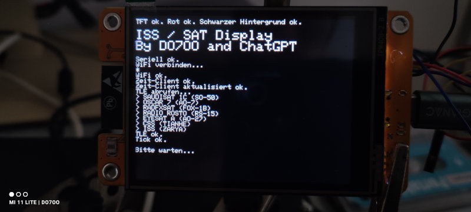
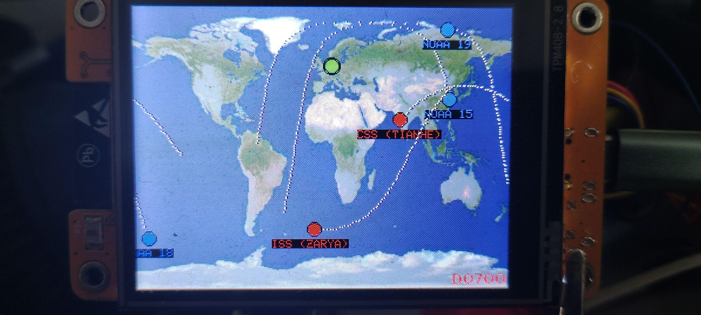

ISS / SAT Display

For ESP32-2432S028 platform.

With a little help of ChatGPT. Why? Why not! ;)

Made on Arduino 2.3.2. You have to add several libraries to Arduino environment:

#include <Sgp4.h>

#include <Ticker.h>

#include <WiFi.h>

#include <HTTPClient.h>

#include <WiFiUdp.h>

#include <NTPClient.h>

#include <TFT_eSPI.h>

#include <PNGdec.h>

Get TLE data from https://celestrak.org/. BTW donate them. They're doing a great job for decades!!!

Goto 'Current Data (GP)'. Then choose category. Amateur for e.g. Choose Table list. In Latest Data (right side of page) you find the right URL. 

Put URL into this part of the code in INO file:

{ Sgp4(), "**https://celestrak.org/NORAD/elements/gp.php?CATNR=27607&FORMAT=tle**", TFT_YELLOW }, // SO50

**Friendly note: You get no warranty, no support, no anything for this project. It's a proove of concept and it has bugs! 
Me and ChatGPT are happy that satellites can be displayed on a cheap chinese ESP32-2432S028.**
